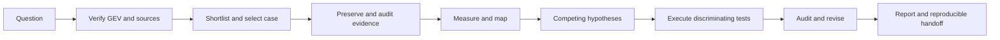

# Satellite Research

A reusable, model-neutral workflow for finding unusual air or satellite activity through **God’s Eye View (GEV)**, investigating competing explanations, executing realistic tests, and delivering a source-linked hypothesis test report.

The repository also includes a [local collection and screening pilot](docs/PIPELINE.md): a lightweight Python service that preserves bounded GEV samples, builds historical comparisons and produces a review queue with frozen calculation replay. It runs without a GPT call at each capture. Its provisional detections are starting points for the investigation workflow, not established causes or operational findings.

The workflow was extracted from the investigation that began with this request:

> The God's Eye View app that we integrated, give me a short list of significant aerial traffic and/or satellite traffic over somewhere on the planet that's an anomaly that might be worth looking into for trade or military purposes.

It ends with a report in the form of [Finland GNSS hypothesis test results](examples/finland-gnss/hypothesis-test-results.md), using **new observations, variables, comparisons and hypotheses** for each future case. A completed investigation may conclude that evidence is inconclusive or that no anomaly was established.

## Start here

Give a model access to this repository and say:

> Read AGENTS.md and follow WORKFLOW.md for this investigation: [your question]. Use available GEV evidence, test competing explanations, and deliver the hypothesis test report with reproducible evidence. State any unavailable capabilities.

Use the [complete starter prompt](prompts/start-investigation.md) when the model does not automatically read repository instructions. In a compatible skill environment, the optional [GEV anomaly research skill](skills/gev-anomaly-research/SKILL.md) supplies the same entry point. Merely knowing the repository name does not give a model access to its files, your local GEV app or connected accounts.

## Workflow chart



The full [workflow chart and 78-step register](WORKFLOW.md) includes the decision branches, inputs, outputs and completion rules. [workflow.json](workflow.json) provides the same stage and step IDs for other models or applications.

| Resource | Purpose |
|---|---|
| [AGENTS.md](AGENTS.md) | Instructions for a model starting or resuming an investigation. |
| [WORKFLOW.md](WORKFLOW.md) | Twelve phases, 78 concrete steps, and a decision chart. |
| [Domain playbooks](playbooks/source-access.md) | GEV/source access, [aircraft and GNSS](playbooks/aircraft-gnss.md), [satellites](playbooks/satellites.md), and [trade impact](playbooks/trade-impact.md). |
| [Run templates](templates/_schema-notes.md) | Case scope, source register, shortlist, hypotheses, test plan, executed results and final report. |
| [Finland chronology](examples/finland-gnss/chronology.md) | What actually happened, including unsuccessful checks and revised conclusions. |
| [Finland lessons](examples/finland-gnss/lessons.md) | How the case changes future investigative decisions. |
| [Worked final report](examples/finland-gnss/hypothesis-test-results.md) | The actual completed test report, with a portability note. |
| [Scripts](scripts/README.md) | Create an isolated case, check repository consistency and build a file-hash manifest. |
| [Validation](VALIDATION.md) | Repository checks and an independent synthetic satellite scenario. |
| [Pilot pipeline](docs/PIPELINE.md) | Architecture, collection cadence, provisional detectors, local service setup, review commands, coverage limits and replay. |

## Run the collection pilot

With Python 3.9+ and a running local GEV, run from the checkout:

```sh
python3 -m satresearch --data-dir data/pilot doctor
python3 -m satresearch --data-dir data/pilot collect
python3 -m satresearch --data-dir data/pilot status
python3 -m satresearch --data-dir data/pilot report --days 7 --output runs/pilot-week-01
```

Read the generated `Report.md` or open `report.html` in that new report directory. The [pipeline guide](docs/PIPELINE.md) explains foreground collection, the reviewable macOS LaunchAgent preparation/install/start/stop steps, analyst labels, integrity checks and offline imports. The collector does not install itself or start GEV.

The default sample covers three regional aircraft anchors every five minutes, up to nine rotating aircraft traces hourly, and three satellite catalog groups every six hours. Dense selected traces support the aircraft continuity screens; five-minute snapshots exceed their default 120-second gap limit. Computer sleep, source availability and sampling gaps remain visible limitations. This is not full global surveillance.

The pilot builds up to a 30-day prior-window baseline. The historical aircraft detector needs at least 30 matched samples across three distinct prior UTC days, checked per entity and comparison group; this is eligibility, not calibration. Collection pauses at the default 10 GiB data threshold or low free space, preserving existing evidence. Screening caps each input set at 250,000 records and marks truncation explicitly. Empty or partial reports cannot establish normal traffic in unobserved areas.

## Create an investigation folder

With Python 3 available, run from this repository:

```sh
python3 scripts/init_case.py new-investigation --question "Find and test a significant anomaly using available GEV evidence"
```

This creates `runs/new-investigation/` with blank evidence and test registers plus report templates. It performs no network requests and marks no test complete. Fill the case with the current investigation’s actual inputs. Run folders are ignored by Git by default; publish a reviewed case deliberately when requested.

## What carries forward

The reusable method includes provenance and timestamp checks, source-separated tracks, normal/abnormal comparisons, falsifiable hypotheses, threshold sensitivity, independent-publisher checks, environmental/service controls, correction of earlier claims, map/report verification and isolated reproduction.

Finland’s dates, coordinates, aircraft, sample counts and thresholds are historical examples, **not defaults**. Satellite maneuver and trade-impact adapters extend the method; those analyses were not completed as part of the Finland GNSS test case. The evidence supports different levels of claim—reported data anomaly, physical effect, mechanism, attribution and operational impact—and the report must state which level is actually established.

## Access and reproducibility

GEV installation, runtime address, tool names, available feeds and account permissions are discovered at run time. The local integration used in the original case is not bundled or installed by this repository. A model with only repository access can read the method and prepare a run, but cannot honestly claim fresh GEV observations until it has queried an available integration.

The public example includes the final report and compact test-result extracts. Full provider histories, the historical binary report bundle and private machine paths are not copied into this repository. See the [example provenance note](examples/finland-gnss/README.md) for the resulting reproduction boundary. Future cases should preserve authorized raw inputs and deterministic calculations according to the workflow.

Workflow version: **1.0.0**. Changes to selection rules, thresholds or interpretation should be versioned in the affected run; changes to this method should preserve stable step IDs or document a migration.
