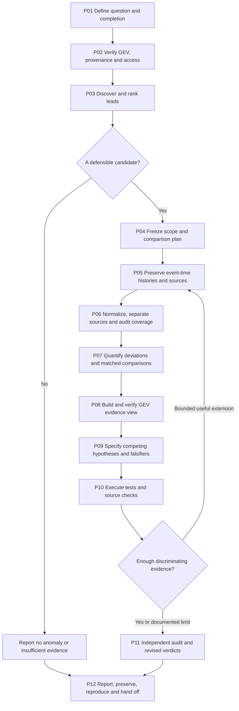

# Investigation workflow

This is the reusable procedure extracted from the GEV investigation that began with a global air/satellite anomaly request and ended with **Finland GNSS hypothesis test results**. It includes successful work, failed access attempts, sensitivity tests, revisions, map verification and reproducibility checks. The [case chronology](examples/finland-gnss/chronology.md) records what actually happened. Satellite and trade adapters include explicitly labeled extensions; they are not represented as tests performed in that case.

Follow the evidence through the stages below. Adapt entities, variables, windows, comparisons and domain tests for each new case. A chart is a guide to decisions, not a promise of a positive anomaly. Read [AGENTS.md](AGENTS.md) for model behavior and [schema notes](templates/_schema-notes.md) for run records.

The machine-readable step register is [workflow.json](workflow.json), version **1.0.0**. Stages may overlap where their inputs are independent; a hypothesis can be proposed before mapping, for example. Keep dependency-sensitive operations sequential, and document any skipped or unavailable step. An unavailable GEV writer does not block read-only analysis: record the map step as unavailable and still deliver the report.

For an explicitly offline run, P02 can be a **partial capability/provenance audit of the supplied export**. Record that no live GEV query was performed, what the supplied metadata establish, and which runtime facts remain unknown. Continue the analysis supported by the supplied evidence.

P07 contains discovery and exploratory calculations. Record their choices before calculating where practical, and state what data were already inspected. P09–P10 formalize competing hypotheses and subsequent tests. Do not retroactively describe an exploratory result as a prospective or held-out test; preserve its chronology and create a new plan version for additional tests.

## Step register

Each row specifies an action, its purpose or decision rule, and the run artifact that records it. Artifact names refer to files inside an investigation run, initialized from [templates](templates/).

### P01 — Define the investigation

| Step | Action and decision rule | Record |
|---|---|---|
| P01.01 | **Capture the request and decision.** Record the original question, region if supplied, time horizon, and what trade or defense question the evidence could inform. | `case.json` |
| P01.02 | **Choose the delivery scope.** In this repository a broad discovery request defaults to shortlist, selected-case investigation, executable tests and a final report. Honor an explicit shortlist-only or narrower request. | `case.json` |
| P01.03 | **Resolve only material ambiguity.** Infer routine choices and state assumptions. Ask only when the answer changes scope or needed authority; continue independent work. | `case.json` |
| P01.04 | **Separate dates and units.** Record event dates, retrieval time, source timezone/precision, coordinate reference and measurement units. Convert supported timestamps to UTC while retaining originals. | `source-register.json` |
| P01.05 | **Set bounded completion criteria.** Define what counts as a completed search and test round. A defensible inconclusive or no-anomaly report is a valid endpoint. | `case.json` |

### P02 — Verify GEV and available evidence

| Step | Action and decision rule | Record |
|---|---|---|
| P02.01 | **Discover the installed integration.** Read relevant GEV evidence instructions and available tool descriptions; distinguish local app, read-only connector and external research capabilities. | `source-register.json` |
| P02.02 | **Read source capabilities first.** Call the available GEV source inventory before queries. Record health, pagination, provenance, coverage, retention and supported history endpoints. | `source-register.json` |
| P02.03 | **Locate the running app when needed.** Discover current runtime and active case rather than reusing an old host or port. Inspect existing cases before editing them. | `case.json` |
| P02.04 | **Probe requested feeds.** Query relevant aircraft, aircraft classification and satellite feeds within supported limits. Treat an interface validation error separately from an upstream request failure. | `source-register.json` |
| P02.05 | **Identify what each record means.** Distinguish observed aircraft position, MLAT solution, satellite catalog element, propagated position, official notice and an external lead. | `source-register.json` |
| P02.06 | **Audit actual use.** Record which conclusions came from GEV and which came from outside reports. Never label a web lead as an anomaly detected in GEV. | `source-register.json` |
| P02.07 | **Choose an access fallback.** Use permitted APIs, local provider routes or ordinary published viewers. Record missing access and stop dependent tests when essential evidence is unavailable. | `source-register.json` |

### P03 — Discover and rank leads

| Step | Action and decision rule | Record |
|---|---|---|
| P03.01 | **Search relevant domains in parallel.** Split independent aircraft, satellite, source/provenance and external-context checks when useful. Give each a bounded output. | `shortlist.md` |
| P03.02 | **Inspect GEV observations.** Search selected regions or a documented global sample. Retain query bounds, returned counts, pagination and position age; one snapshot is not a baseline. | `source-register.json` |
| P03.03 | **Find dated public context.** Check primary regulators, operators, official statistics and original technical analyses. Preserve event date separately from publication date. | `source-register.json` |
| P03.04 | **Check ordinary explanations.** Compare with known routes, schedules, maneuvers, sensor coverage, software behavior and service events as applicable. | `shortlist.md` |
| P03.05 | **Assign evidence status.** Label each lead observed candidate, reported lead, context-only, unsupported, or unobservable. Record missing baseline or raw data explicitly. | `shortlist.md` |
| P03.06 | **Rank by investigation value.** Consider evidence quality, deviation from a relevant baseline, plausible operational significance and availability of a discriminating test. Avoid invented precise probabilities. | `shortlist.md` |
| P03.07 | **Select a case.** Follow the user selection; otherwise choose the best-supported, testable case and explain the choice. If none qualifies, produce a negative or evidence-gap report. | `case.json` |

### P04 — Freeze the case and comparison plan

| Step | Action and decision rule | Record |
|---|---|---|
| P04.01 | **Assign a stable case ID.** Create an isolated run with the workflow version, scope, selected entities and original lead links. | `case.json` |
| P04.02 | **Fix event windows and region.** Define study windows and geographic/altitude/orbital bounds before extending observations. Do not move windows merely to obtain a favorable result. | `test-plan.json` |
| P04.03 | **Define units and denominators.** Specify record, aircraft, pass, event and duration separately. Identify the eligible population or acknowledge a convenience sample. | `test-plan.json` |
| P04.04 | **Define comparators and exclusions.** Choose physically relevant time, place, equipment, altitude or orbital matches. Keep missing, excluded, source-switched and healthy records distinct. | `test-plan.json` |
| P04.05 | **Version changes to selection.** Record amendments and reasons before retrieving or examining the next batch. Preserve earlier versions; distinguish discovery from confirmation. | `test-plan.json` |

### P05 — Acquire and preserve event-time evidence

| Step | Action and decision rule | Record |
|---|---|---|
| P05.01 | **Capture source responses.** Save allowed raw response bodies or structured snapshots with URLs, query parameters, timestamps, status and schema/provider version. | `source-register.json` |
| P05.02 | **Retrieve complete available histories.** Use supported pagination or the documented full-history endpoint. Count raw records and record actual first/last event coverage. | `source-register.json` |
| P05.03 | **Resolve identity per event.** Bind identifiers, registration/catalog identity, callsign or mission label to the relevant interval; do not apply the latest flight label to an earlier flight. | `source-register.json` |
| P05.04 | **Preserve refreshes separately.** Keep previous and refreshed versions with hashes and retrieval times. Use an explicit latest-version rule for aggregate counts. | `source-register.json` |
| P05.05 | **Capture source documentation.** Read the applicable field definitions and, when material, pinned decoder/serialization or propagation versions. Do not silently substitute current code. | `source-register.json` |
| P05.06 | **Log failures precisely.** Preserve tool validation failure, DNS/network failure, HTTP status, empty payload, unavailable history and unsupported browser export as distinct outcomes. | `source-register.json` |
| P05.07 | **Check archive coverage before corroborating.** Verify that another provider actually covers the original event. Later flights or a live page are not historical corroboration. | `source-register.json` |

### P06 — Normalize and audit the observations

| Step | Action and decision rule | Record |
|---|---|---|
| P06.01 | **Verify saved integrity.** Check copied bytes/hashes, parseability, ordering, duplicates, timestamps, units and coordinate ranges without rewriting preserved inputs. | `test-results.json` |
| P06.02 | **Keep unknown values unknown.** Separate zero, missing, invalid, stale-marked and not-applicable values. Quality categories are not measurements of actual error. | `test-results.json` |
| P06.03 | **Separate sources and field ages.** Retain position-source labels and explicit state objects. A fresh position does not establish freshness of every metadata field. | `test-results.json` |
| P06.04 | **Flag transitions and gaps.** Mark source changes, long gaps, time discontinuities and relevant stale flags. Do not create measured paths by joining incompatible records. | `test-results.json` |
| P06.05 | **Audit completeness and bias.** Compare snapshot age with position age, identify ground transmitters, check selection through potentially corrupted positions and account for unobserved entities. | `test-results.json` |
| P06.06 | **Construct eligible analysis sets.** Apply documented region, event, altitude, source and metadata rules; record retained and excluded counts at each step. | `test-results.json` |

### P07 — Quantify the candidate anomaly

| Step | Action and decision rule | Record |
|---|---|---|
| P07.01 | **Calculate basic deviations.** Measure durations, geographic or orbital residuals, source disagreement, implied motion and quality-state changes using the appropriate domain adapter. | `test-results.json` |
| P07.02 | **Separate persistence from extremes.** Distinguish a single jump from a sustained or recurrent branch. Describe spread, range, sample spacing and retained duration honestly. | `test-results.json` |
| P07.03 | **Compare like with like.** Seek within-entity normal/abnormal passes and contemporaneous controls. Expose time/location/altitude/equipment confounding. | `test-results.json` |
| P07.04 | **Check internal consistency.** Compare coordinate-derived motion and reported motion; inspect retained metadata and source-specific branches. Do not treat derived fields as independent sensors. | `test-results.json` |
| P07.05 | **Label exploratory models.** If fitting loops, trends or changepoints, preserve fitting choices, residuals and sensitivity. A fitted center or period is not a source or intent fingerprint. | `test-results.json` |
| P07.06 | **State the measurement-level finding.** Describe exactly what is anomalous in the saved evidence before proposing its physical or operational cause. | `report.md` |

### P08 — Create and verify the GEV evidence view

| Step | Action and decision rule | Record |
|---|---|---|
| P08.01 | **Prepare a source-linked case.** When GEV map writing is available and within scope, construct case metadata, source entries, UTC timeline, reported-location pins and defensible paths. | `gev-case.json` |
| P08.02 | **Preserve location uncertainty.** Distinguish reported, independently verified, approximate and unknown positions. In a positioning anomaly, provider coordinates do not mean true position. | `gev-case.json` |
| P08.03 | **Segment paths by provenance.** Keep ADS-B, MLAT and other branches separate; split unsupported gaps and transitions. Never draw an inferred route as measured motion. | `gev-case.json` |
| P08.04 | **Validate and publish locally.** Use the installed case contract and publisher, preserve other cases and backups, and honor filesystem permissions. Do not use a read-only connector as a writer. | `gev-case.json` |
| P08.05 | **Verify the rendered case.** Open the actual case. Check title, selected evidence, pin locations, source details, filters, timeline and relevant original-source links. | `test-results.json` |
| P08.06 | **Verify any accompanying visualization.** Check source visibility controls, legends, units, timestamps and served report/data bytes. Restore the complete intended view after testing filters. | `test-results.json` |

### P09 — Form competing, falsifiable hypotheses

| Step | Action and decision rule | Record |
|---|---|---|
| P09.01 | **Build a causal alternative set.** Include real-world change, measurement/processing artifact, equipment behavior, environmental effects and ordinary operations where relevant. Hypotheses may coexist. | `hypotheses.json` |
| P09.02 | **Specify observable predictions.** For each hypothesis state what should differ, in which records, at what time and relative to which comparator. | `hypotheses.json` |
| P09.03 | **Specify falsifiers and discriminating evidence.** State a result that would weaken the claim and the evidence needed to distinguish it from its strongest alternative. | `hypotheses.json` |
| P09.04 | **Record dependencies and confounders.** Distinguish publisher, feeder, receiver, decoder and onboard independence. Record asynchronous fields and shared software/configuration. | `hypotheses.json` |
| P09.05 | **Choose feasible tests.** Prioritize passive tests with available data and high ability to distinguish causes. Mark unavailable raw-message or onboard tests explicitly. | `test-plan.json` |
| P09.06 | **Separate implications from mechanism.** Identify the evidence needed for trade impact, resilience consequences or attribution; anomalous geometry alone does not establish these. | `hypotheses.json` |

### P10 — Execute robustness and external tests

| Step | Action and decision rule | Record |
|---|---|---|
| P10.01 | **Record a test plan before calculating.** Version the input set, event window, thresholds, expected outcomes and eligibility rules; label post-discovery sensitivity analysis honestly. | `test-plan.json` |
| P10.02 | **Test simple local explanations.** Check source-label consistency, stale flags, ordering, frozen metadata, extreme points and coordinate-derived motion as applicable. | `test-results.json` |
| P10.03 | **Sweep meaningful thresholds.** Vary source-transition buffers, outlier screens and matching tolerances; report when a strict filter removes all usable data. | `test-results.json` |
| P10.04 | **Recheck within-entity contrasts.** Test whether the strongest normal/abnormal comparison survives stricter position, altitude, direction and source rules. | `test-results.json` |
| P10.05 | **Recheck cross-entity timing.** Separate record coincidence from event onset; test sensitivity to stale records and source transitions. Exclusions may remove genuine effects. | `test-results.json` |
| P10.06 | **Expand the cohort with a recorded rule.** Acquire all eligible additional histories within the bounded selection plan; preserve amendments and refresh versions. | `source-register.json` |
| P10.07 | **Evaluate new controls.** Count eligible and ineligible comparisons. Zero matched controls means insufficient evidence, not healthy traffic or absence of an effect. | `test-results.json` |
| P10.08 | **Seek another event-time publication.** Use another authorized archive or published viewer. Compare actual timestamps, coordinates and precision; preserve sparse manual readings as such. | `test-results.json` |
| P10.09 | **Evaluate true source independence.** Record shared feeder/software possibilities. Only perform independent decoding if original messages and required metadata actually exist. | `test-results.json` |
| P10.10 | **Test environmental and service alternatives.** Align official local/global environmental observations, satellite or navigation service notices and closures with the actual event windows. | `test-results.json` |
| P10.11 | **Check stale and superseded notices.** Verify notice closures, future scheduled events, cached pages, missing product windows and differences between estimates and finalized measurements. | `test-results.json` |
| P10.12 | **Record executed outcomes and blocked tests.** Store measured values, inputs, method and result for each executed test; preserve failure/unknown/not-applicable states without inventing a finding. | `test-results.json` |

### P11 — Audit and revise conclusions

| Step | Action and decision rule | Record |
|---|---|---|
| P11.01 | **Recompute material numbers independently.** Use a separate calculation or reviewer for central counts, geometry, filters and comparisons where useful. Review discrepancies rather than voting. | `test-results.json` |
| P11.02 | **Audit causal language.** Check whether the evidence supports a feed anomaly, a physical effect, a mechanism, an actor or an operational impact; do not skip levels. | `report.md` |
| P11.03 | **Update every hypothesis.** Use evidence-linked supported, weakened, inconclusive, not-tested or not-applicable judgments. Avoid calibrated odds without a justified model. | `hypotheses.json` |
| P11.04 | **Propagate corrections.** Supersede earlier synchronization, coverage or service-status claims wherever they matter. Preserve the historical record with explicit correction notes. | `report.md` |
| P11.05 | **Identify the next decisive evidence.** Name the specific missing observation and how it would discriminate causes. Do not turn a blocked test into an unrequested outreach or monitoring task. | `report.md` |

### P12 — Deliver and preserve a reusable result

| Step | Action and decision rule | Record |
|---|---|---|
| P12.01 | **Write the self-contained report.** Lead with findings and revised hypotheses, then methods, actual test outcomes, uncertainty, implications and source/reproduction information. | `report.md` |
| P12.02 | **Verify the rendered deliverable.** Check tables, links, figures and timestamps. If producing PDF, render and visually inspect it. Check map/report accessibility when publishing locally. | `test-results.json` |
| P12.03 | **Package authorized evidence.** Include permitted raw inputs, plans, calculations, results, source notes and a manifest. Keep credentials, personal machine paths and unrelated logs out of shared artifacts. | `manifest.json` |
| P12.04 | **Reproduce from preserved inputs.** Rerun deterministic calculations in an isolated copy; compare results without refetching rolling sources or altering original evidence. | `test-results.json` |
| P12.05 | **Verify delivery.** Check archive integrity and links; for Git delivery confirm the remote commit and files. State exactly what was delivered and any access limitations. | `report.md` |
| P12.06 | **Make handoff self-contained.** Record workflow version, case state, revised verdicts and the next discriminating evidence so another model can resume without chat memory. | `case.json` |

## Conditional domain branches

- **Aircraft/navigation:** [aircraft-gnss.md](playbooks/aircraft-gnss.md).
- **Satellite/orbital activity:** [satellites.md](playbooks/satellites.md). Check catalog/epoch/propagation limitations before claiming maneuver or proximity.
- **Trade significance:** [trade-impact.md](playbooks/trade-impact.md). Require operational or economic evidence in addition to traffic anomalies.
- **GEV and external access:** [source-access.md](playbooks/source-access.md). Record precise capabilities and failures for the current environment.

Never carry the Finland coordinates, flight identities, numerical thresholds, dates, five-hypothesis labels or verdicts into a new case as defaults. Reuse the questions and tests, then choose parameters justified by the new data and domain.
