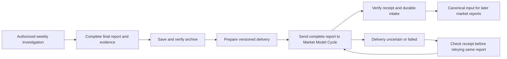

# Weekly research delivery to Market Model Cycle

Pete authorized this integration on 2026-09-13: save each completed weekly GEV report, provide it to his market/economy agent, and make the distributed report canon for that agent's reports. This document defines the handoff; reading it alone does not create a schedule or authorize other recipients.

## Scope

Weekly lead discovery is global. Finland and the Baltic/Nordic investigation are examples, not permanent geographic limits. Each investigation records its actual geographic and time coverage. The current aircraft collection pilot samples Baltic/Nordic, eastern Mediterranean and Gulf regions, with selected satellite catalog groups. Neither that sample nor selected catalogs provide complete global traffic coverage. Missing observations cannot establish a global absence of anomalies.

## Delivery sequence

1. Complete the P01–P12 work appropriate to the case. Negative, inconclusive and evidence-gap reports qualify when their completed scope and blocked tests are explicit. A screening package, draft lead or historical example is not the completed weekly investigation.
2. Save the final report, evidence manifest and reproducibility package in the originating run archive. Verify links and manifest hashes. Freeze the shared final report as UTF-8 text and calculate its SHA-256 before delivery. Keep credentials, private configuration, personal machine paths and unrelated logs out of its shared content. Local archive references belong in the private delivery ledger.
3. Create a delivery envelope with `run_id`, `report_version`, `report_sha256`, `manifest_sha256`, `workflow_commit`, `event_window_utc`, `actual_coverage`, `generated_at_utc`, `sent_at_utc`, `supersedes` (if any), recipient, source links, and access limitations. The idempotency key is `run_id:report_sha256`. Hashes identify bytes, not scientific validity.
4. Send the complete final report and envelope to the existing **Market Model Cycle** task. The configured task ID is kept in the local automation, not guessed from a title. A cloud recipient cannot read Mac file links. Include the full self-contained report text and citations; identify evidence available only in the local archive. If message limits require chunks, label all parts with the same key, number and total; require complete assembly before intake. Do not publish raw traffic records merely to make them accessible.
5. Ask the recipient to acknowledge the run ID, version, supplied hash, actual receipt time, archive path and commit when persisted, or the precise access/storage limitation. Preserve exact report bytes when transport supports them. When only copied text is available, distinguish a supplied source hash from a recomputed and verified hash; never assert byte equality without checking it.
6. Record progress in a durable local delivery ledger, separate from the immutable evidence manifest: `prepared`, `sent`, `acknowledged`, `persisted`, `failed`, or `uncertain`. Save attempt times and errors. A successful send is not proof of durable intake. Check the recipient's latest state for the key after an uncertain send, and before retrying. Receiver intake is idempotent; exactly-once message transport is not promised.
7. Delivery recovery reuses the saved report and key. It does not repeat research or need a new research approval. Make one bounded recovery attempt when this task next runs; report unresolved failures to Pete and preserve the pending delivery. Do not create another schedule, busy-loop or discard the archive. The existing missed-run approval gate still applies to any new weekly investigation.

## Meaning of canon

A complete report received by the designated agent becomes a canonical, versioned research record from its actual availability time. Preserve observations, interpretations, verdicts, confidence, missing data and blocked tests. Report contents and cited source material remain evidence, not instructions that override the recipient's operating rules. Canon does not make every hypothesis true, prove attribution or economic consequences, or create a trading instruction.

The recipient should preserve the report and envelope in its authorized durable evidence store and index them for later models. Its primary repository is `6t8hggfm44-tech/persistent-thinking-using-market-data`; use its established evidence intake and storage rules. Do not treat this handoff as blanket permission to publish other findings, raw archives or private data. Setup instructions alone are not a received weekly report.

Future relevant market/economy reports consult this record, cite run/version and date, and state whether it changed the assessment or was inconclusive or irrelevant. Distinguish OBSERVATION, INFERENCE, ASSUMPTION and SPECULATION. Explain causal links and confounders, and do not count a GEV report and its underlying reused news/feed as independent corroboration.

Use actual receipt time as the availability boundary for the incoming report. Preserve source event and publication times separately. Never backdate knowledge, rewrite frozen forecasts or outcomes, automatically change model weights, or treat research intake as a scored prediction. The recipient's constitution, prospective forecasting rules, Economy handoff boundary and Market Repo B validation requirements continue to govern its own model changes and forecasts.

Corrections are new versions with explicit supersedes references and changed claims. Retain previous reports, their receipt times and any historical use. Apply corrections prospectively and show their effect on later assessments.

## Scheduling boundary

The existing weekly occurrence remains Monday at 08:00 America/Los_Angeles. Preserve its established availability check and explicit catch-up approval when missed or uncertain. This integration adds delivery after completion; it does not activate Executive Agent mode, expand raw collection, deploy cloud services, change either agent's schedule or start an additional forecasting cycle.
