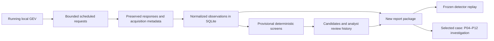

# Local collection and screening pilot

The pilot preserves selected GEV responses, normalizes them into a local evidence store, and screens for patterns that merit investigation. It produces a review queue and reproducible report packages. A candidate is a data pattern; establishing its physical cause or operational significance requires the [investigation workflow](../WORKFLOW.md).

This is a Python 3.9+ implementation using the standard library. Collection, normalization, screening, storage and report generation run without a GPT call at each capture. A model or analyst can review a package later and execute the feasible hypothesis tests. The collector does not implement the entire P01–P12 investigation automatically.

## Architecture



The modules have distinct responsibilities:

| Component | Implemented behavior |
|---|---|
| [Collector](../satresearch/collector.py) | Discovers a running local GEV, requests due regional snapshots, selected aircraft traces and catalog groups, and preserves responses, errors and cooldowns. |
| [Aircraft normalizer](../satresearch/normalize.py) | Retains event time, acquisition time, position method, units, stale indicators and unknown fields. Rejects a trace whose supplied aircraft identity conflicts with the requested identity. |
| [Evidence store](../satresearch/storage.py) | Stores compressed response bodies by hash, acquisition metadata, distinct observation revisions, source links, candidates and append-only analyst review decisions. Repeated acquisitions do not become independent measurements merely because they were downloaded again. |
| [Aircraft screens](../satresearch/aircraft.py) and [satellite screens](../satresearch/satellites.py) | Apply versioned rules to eligible saved data. Retain evidence IDs, measurements, limitations and alternative explanations. |
| [Reporting](../satresearch/reporting.py) | Saves a new HTML/Markdown review package, structured data, cited responses, configuration, hashes and exact detector inputs/code for offline replay. |
| [Command entry point](../satresearch/__main__.py) | Provides one-cycle collection, a persistent service, reports, status, integrity checks, review labels and offline import. |

Requests go through the local GEV runtime. The collector does not copy credentials or directly switch to an external provider. GEV determines which upstream services are available. Original GEV responses are processed provider products, not original ADS-B radio messages or independently verified positions.

## Default scope and cadence

The defaults are in [config/pilot.json](../config/pilot.json). Cadences are minimum due intervals, measured after a completed request; the service checks them about once a minute. Request duration, provider cooldowns, runtime failures and computer sleep can delay the next sample.

| Work | Default cadence | Selection |
|---|---|---|
| Aircraft snapshots | 300 seconds | One request for each of three regional anchors; normalized positions are filtered to that region's rectangle. |
| Aircraft traces | 3,600 seconds | Up to three aircraft per region, selected by a deterministic rotating offset through sorted identifiers observed in regional snapshots during the preceding 30 minutes. At most nine distinct aircraft per round; overlap or missing observations can reduce the total. |
| Satellite catalogs | 21,600 seconds | `stations`, `weather` and `gps-ops` groups through GEV. These groups are not a complete spacecraft census. |
| In-service screening | About hourly | The preceding 24 hours of preserved data plus eligible prior history. It runs once during the first service cycle, then checks hourly. |
| Review package | On command | `report` defaults to the preceding seven days. A weekly invocation or notification must be configured separately; the service itself does not schedule reports. |

| Region ID | Anchor, latitude / longitude | Rectangle, west / south / east / north |
|---|---|---|
| `baltic-nordic` | 60 / 25 | 16 / 55 / 34 / 67 |
| `eastern-mediterranean` | 34 / 32 | 25 / 29 / 39 / 39 |
| `gulf` | 26 / 54 | 47 / 21 / 61 / 31 |

GEV's regional adsb.lol fallback samples approximately 250 nautical miles around the requested anchor. The rectangle is a local selection boundary, not a promise that the provider observes every point inside it. A selected full trace may include positions outside all watch regions; these are labeled `outside_watch_regions`. The trace cohort is a changing convenience sample, not a representative random sample or an inventory of military flights.

Five-minute snapshots exceed the aircraft screens' default **120-second maximum adjacent-record gap**. Coordinate-jump and persistence detection therefore depend primarily on available dense traces for selected aircraft, with their freshness and source requirements. Increasing a continuity threshold simply to connect sparse snapshots changes the interpretation and needs explicit review.

The service cannot collect while the computer is asleep, logged out, offline, or unable to reach a running GEV. It tries due work after resuming. A later selected trace may happen to contain earlier observations, but complete backfill is not implemented or guaranteed. The collector does not wake the computer or start GEV.

## Baseline and provisional detectors

The intended initial observation period is 30 days, matching the configured historical lookback. This is a history-building period, not a calibration exercise or a blanket delay before all screens run. Each report requests up to 30 days **before the report window starts**. A complete seven-day report plus a full preceding 30-day baseline requires 37 days of usable history, absent an earlier preserved import.

The aircraft historical-speed rule requires at least 30 eligible prior samples across at least three distinct UTC days for the particular entity and region, with comparable source, position method and altitude datum. It also restricts altitude differences to 1,500 metres. Three days of observations somewhere in the store do not establish eligibility for every aircraft. The report's aggregate `warming_up` indicator is only a coarse history summary; eligibility is checked inside the detector. Changing the lookback or passing synthetic tests does not establish precision, recall or a field false-alarm rate.

All thresholds below are prototype attention rules, not calibrated physical classifications. Effective settings and detector versions are written into each report.

| Screen | Default trigger and safeguards |
|---|---|
| Coordinate jump | Adjacent reported positions at least 5 km apart imply more than 600 m/s over a 1–120 second gap. Stale or invalid positions are excluded. Source switches and unknown position ages remain explicit limitations and reduce review priority; the result does not assert a physically impossible aircraft movement. |
| Frozen reported position | At least four distinct eligible timestamps spanning 180 seconds remain within 20 metres of the first position while reporting at least 75 m/s. Requires consistent known source/method and bounded gaps. Ground observations are excluded. |
| Low reported speed aloft | At least four eligible points spanning 180 seconds report no more than 35 m/s at an altitude of at least 6,000 metres, with source and continuity guards. Unknown speed-field age, wind, equipment and data processing remain alternatives. |
| Historical speed outlier | Compares with eligible history for the same entity, region, publisher, position method and altitude datum. Deviation must exceed the larger of 75 m/s or six scaled median absolute deviations. Event-window observations are excluded from the historical baseline. |
| Catalog age, time or conflict | Flags orbital epochs more than 72 hours old at retrieval, epochs later than retrieval, or conflicting elements for the same object/source/epoch. These describe catalog records, not a physical satellite event. |
| Catalog element discontinuity | Compares eligible successive epochs from the same object/source, no more than 168 hours apart. Screens absolute changes above 0.1 revolutions/day in mean motion, 0.2° in inclination or 1° in wrapped RAAN. Ordinary refitting, drift and maintenance can explain a candidate. |

Aircraft position age is distinct from attached field age. A trace's clear stale-position bit means only that its serializer did not flag the position stale; it does not establish a zero-second measurement age. Persistence rules can use that explicit indicator with a limitation. If GEV's fallback discarded the original position method, the normalizer records `unknown` rather than interpreting a placeholder as ADS-B.

Trace provider-version text is retained when supplied; missing versions remain unknown. The current trace adapter also emits `trace_schema_interpretation_not_version_pinned`: retaining a version string does not establish that every provider release uses the assumed field layout. Check pinned source documentation before using a candidate for a more specific claim.

Satellite elements are fitted estimates. The pilot does not propagate orbits, align their epochs for a physical residual calculation, use covariance, estimate collision probability, or test rendezvous or intent. Neither a catalog discontinuity nor an aircraft data anomaly establishes interference, attribution, military activity, cargo loss or a trading opportunity.

## Setup and one-cycle operation

Run commands from the repository checkout. Use a stable Python 3.9+ installation and a writable data directory. GEV must already be installed and running. Default discovery uses the installed Pinokio `pterm` runtime; an optional local JSON override can supply `gev_base_url` or `pterm_command` when automatic discovery is unavailable. Only a loopback base URL is accepted.

```sh
python3 --version
python3 -m satresearch --data-dir data/pilot doctor
python3 -m satresearch --data-dir data/pilot collect
python3 -m satresearch --data-dir data/pilot status
python3 -m satresearch --data-dir data/pilot verify
```

`doctor` checks discovery/configuration and opens the local store; it does not collect traffic. A supplied base URL is validated locally, so a successful `doctor` is not proof of usable upstream coverage. Inspect the collection result and `status` for actual source outcomes. `verify` checks stored integrity and links, not scientific truth.

Keep machine-specific overrides in the Git-ignored `config/local.json`, and pass `--config config/local.json` consistently. Overrides merge at the top level, so supplying `regions`, for example, replaces that whole list. The collector archives the effective configuration by hash. Use a separate data directory for experiments that change selection or thresholds.

`collect --force` bypasses the normal cadence, but still respects provider cooldowns. Numeric and HTTP-date `Retry-After` values are retained; authentication failures impose a cooldown of at least six hours. A failed request, malformed response, empty result and unavailable runtime have different statuses. None establishes the absence of traffic.

For a foreground service:

```sh
python3 -m satresearch --data-dir data/pilot service
```

Stop it with Ctrl-C. A writer lock prevents a second collector or replay importer from writing measurement data into the same directory simultaneously.

## Optional macOS login service

[prepare_collector_service.py](../scripts/prepare_collector_service.py) prepares a LaunchAgent definition for inspection; it does not install or start it. From the checkout, choose a stable interpreter and prepare the definition:

```sh
RESEARCH_ROOT="$PWD"
RESEARCH_DATA="$RESEARCH_ROOT/data/pilot"
RESEARCH_CONFIG="$RESEARCH_ROOT/config/pilot.json"
RESEARCH_PLIST="$RESEARCH_DATA/service/com.satellite-research.collector.plist"
mkdir -p "$RESEARCH_DATA"
python3 scripts/prepare_collector_service.py \
  --data-dir "$RESEARCH_DATA" \
  --config "$RESEARCH_CONFIG" \
  --output "$RESEARCH_PLIST"
plutil -lint "$RESEARCH_PLIST"
plutil -p "$RESEARCH_PLIST"
```

The definition records the actual interpreter, checkout, configuration, data directory and log paths. Review those resolved paths and the configuration before installing. The preparation script refuses to overwrite an existing definition. If you relocate the checkout or interpreter, prepare and inspect a new definition.

After reviewing the definition, install and start it in the current user's login session:

```sh
mkdir -p "$HOME/Library/LaunchAgents"
cp "$RESEARCH_PLIST" "$HOME/Library/LaunchAgents/com.satellite-research.collector.plist"
launchctl bootstrap "gui/$(id -u)" "$HOME/Library/LaunchAgents/com.satellite-research.collector.plist"
launchctl print "gui/$(id -u)/com.satellite-research.collector"
python3 -m satresearch --data-dir "$RESEARCH_DATA" status
```

The definition uses `RunAtLoad` and `KeepAlive`, with a 60-second restart throttle. It writes `service.stdout.log` and `service.stderr.log` in the data directory. It operates in the logged-in user's session and has the same sleep and GEV availability limits as foreground collection. No GPT process is launched by this service.

Unload it to stop collection; killing the process alone can cause `KeepAlive` to restart it:

```sh
launchctl bootout "gui/$(id -u)/com.satellite-research.collector"
```

To keep it from loading at the next login, remove its installed definition after unloading:

```sh
rm "$HOME/Library/LaunchAgents/com.satellite-research.collector.plist"
```

The data directory is retained. To restart an unloaded service whose definition is still installed, run `launchctl bootstrap` again. Unload an existing service before replacing its definition.

### Assisted installation and recovery

The [user-run installer](../scripts/install_collector_service.py) validates and installs the prepared definition without stopping a working collector:

```sh
python3 scripts/install_collector_service.py "$RESEARCH_PLIST" --check-only
python3 scripts/install_collector_service.py "$RESEARCH_PLIST"
```

Run the second command as the ordinary logged-in user, without `sudo`. The check-only command makes no changes. If an assistant cannot obtain the required folder permission, the user must run the installer directly; launching it through another application is not a substitute for permission.

The installer refuses a conflicting existing definition and accepts an identical one. It enables only this service and registers it if absent. It never kills the current collector or removes its lock. When a manually started collector is still running, macOS's job may wait through throttled lock failures; `KeepAlive` lets it take over after that collector exits. This is reported as **registered awaiting takeover**, rather than verified managed collection.

Registration and collection health are separate. The installer compares the PID reported by `launchctl` with a recent collector heartbeat and checks the actual writer lock. Even a verified managed process can report unavailable GEV, partial acquisition or blocked capacity. The result is saved as `autostart-installation.json` in the data directory. If no managed heartbeat is available yet, registration is reported as unverified collection. Inspect status later; never infer successful acquisition from an installed plist alone.

Automatic recovery covers process exit and login while the user's session is active. It does not detect every hung process, start GEV, wake the Mac, or recover missing observations. Unload the job before intentionally stopping managed collection, because `KeepAlive` restarts even clean exits. The separate weekly model investigation and its missed-run approval rules are unaffected.

## Review and investigate

Create a new package directory for each report:

```sh
python3 -m satresearch --data-dir data/pilot report --days 7 --output runs/pilot-week-01
```

Open `runs/pilot-week-01/report.html` in a browser, or read `Report.md`. The HTML view filters candidates by text and domain. Both views are accompanied by exact metrics and limitations in `events.json`. Report generation refuses to overwrite an existing directory; generating a new package also refreshes the saved candidate queue.

Read `coverage.json` alongside the candidates. Its denominator is expected regional collection slots, including periods before installation and during outages. “Fresh snapshots” describes usable acquisition responses under the feed-time check; it does not mean every aircraft position and attached field was fresh. Zero saved data is not zero traffic. Traces and catalog groups also have selection gaps that a snapshot count cannot measure.

Each candidate has a stable event ID for its detector/version, entity, region and time span, exact evidence links, a priority for review and separate review/hypothesis statuses. Priority is not a probability. Initial statuses are `unreviewed` and `not_tested`. To save a decision, substitute an actual ID from the report:

```sh
python3 -m satresearch --data-dir data/pilot review EVENT_ID needs_more_data \
  --note "Event-time comparison coverage is insufficient; obtain a matched source history."
python3 -m satresearch --data-dir data/pilot status
```

Allowed decisions are `confirmed_data_anomaly`, `explained`, `needs_more_data` and `dismissed`. Each decision needs a note and is retained in review history. Confirming a data anomaly does not confirm its cause. Existing packages remain frozen; produce a new package to include later review decisions. Labels do not automatically train the detectors or mark hypothesis tests complete.

For a promising candidate, create an investigation using the [starter prompt](../prompts/start-investigation.md) and [run templates](../templates/_schema-notes.md), retain the screening package, and execute the relevant P04–P12 work. The [Finland example](../examples/finland-gnss/README.md) illustrates this further investigation; its historical thresholds and verdicts are not pilot calibration data.

## Capacity, preservation and replay

The default collection guard pauses new collection when the data directory is at least **10 GiB** or available disk space is below **1 GiB**. It retains existing evidence; there is no automatic deletion, rolling retention or archival migration. The capacity check runs before a collection cycle, so a cycle can take the directory beyond its threshold. Reports and other filesystem writes are not a hard quota enforced by this guard. Inspect `status` and storage regularly; preserve and verify data before choosing a larger budget or a new collection directory.

Requests have a 35-second timeout and a 16 MiB response cap. An oversized response is saved only as a marked prefix and is not normalized as a complete payload. Screening has a separate **250,000-record cap for each of four input sets**: current aircraft, historical aircraft, current satellite and historical satellite. A busy week can reach this cap. Selection is deterministic, not random; capped sets are named in the report, and resulting candidates are marked partial. No candidates under these limits is not a global negative result.

The data directory contains `store.sqlite3`, compressed bodies in `raw/`, effective settings in `config-history/`, per-source scheduling state, collector health and service status. Preserve the whole directory when transferring the store, with the collector stopped for a consistent filesystem copy. Response hashes verify saved bytes; they do not establish source authenticity or independent sensing.

A report contains `summary.json`, `events.json`, `coverage.json`, `baseline.json`, capture and evidence registers, cited observations/responses, review history, effective detector settings and a file manifest. It also freezes normalized detector inputs and copies of the detector code under `replay/`:

```sh
python3 runs/pilot-week-01/replay/replay.py
```

A passing replay means the saved inputs and code reproduce the candidate calculations, ignoring later analyst review labels. It does not rerun normalization, refetch historical evidence or validate a physical cause. The report's manifest records file hashes, and its source credits identify OpenSky Network, adsb.lol and CelesTrak through GEV. Check captured provenance and applicable source terms before sharing local data or reports; acquisition metadata can contain machine-specific runtime details.

For an offline experiment, import a preserved response body into a separate replay store. Supply its actual original acquisition time and source, with original headers if available. For example, after replacing the illustrative timestamp and filename:

```sh
python3 -m satresearch --data-dir data/replay-example ingest \
  --kind trace --input evidence/trace.json --entity abc123 \
  --retrieved-at 2026-01-01T12:00:00Z --source preserved-gev-trace
python3 -m satresearch --data-dir data/replay-example report \
  --days 1 --end 2026-01-01T12:00:00Z --output runs/replay-example
```

`ingest` accepts an OpenSky-compatible response body, a readsb trace body, or supported TLE/OMM catalog content through `--kind opensky`, `trace` or `tle`. An outer chat/tool wrapper must first be distinguished from its actual payload; do not call a wrapper the original HTTP body. For snapshot imports, use `--headers` when original GEV source headers exist and `--region` for a configured region. Imported records retain an offline-provenance caveat. An import supplies only the evidence in that file; it does not acquire missing history or paid data.
