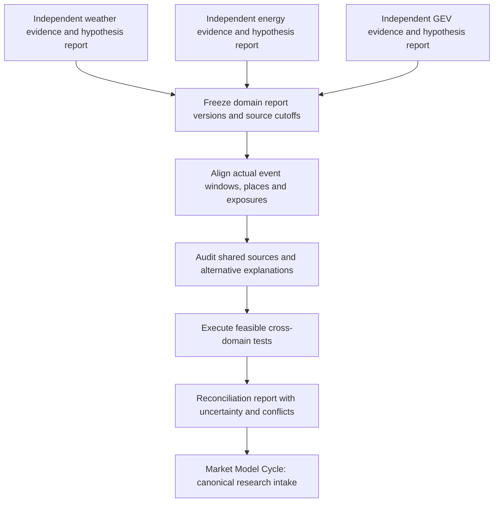

# Weather, energy and GEV reconciliation

Version 1.0.0. Pete authorized these complementary weekly research workflows on 2026-09-14. Each domain retains an independent report and evidence archive. Reconciliation is a separately identified synthesis, not a rewrite of those reports.

## Order of work

1. Weather first tests its own physical claims without seeing the current energy-price or GEV narrative as a target to fit. Energy and GEV preserve their own original observations and hypothesis plans before a cross-domain interpretation. Historical weather covariates may be used when their inclusion is predeclared and their actual vintage is recorded. Seeing another report must be recorded; it precludes claiming an untouched independent interpretation afterwards.
2. Freeze each final report, manifest, plan and source cutoff. Prepare `report-envelope.json` from the template. Source forecasts need issuance time, valid time and lead time; observations, estimates, assimilated/model weather and later reanalysis remain distinct. Domain report generation time and recipient receipt time are different.
3. Use the latest non-superseded complete report actually available at the synthesis cutoff. List missing, older, incomplete and future-available reports; do not silently carry old reports forward as this week's evidence. A report available after an earlier market forecast cannot become evidence for that forecast. No waiting indefinitely for all three reports.
4. `scripts/reconcile_reports.py` verifies supplied report/manifest hashes, applies the availability cutoff, marks supplied supersession and records shared-source ancestry. It creates an input audit for an analyst. It does not test causation, prove source independence, or write the finished reconciliation hypothesis report.
5. Align UTC event windows, source calendar periods and geography. Use the intersection for comparisons and list unmatched intervals. A weekly national fuel estimate, a daily model grid point and second-level aircraft records do not share measurement support. Specify exposure mapping, distance/area/altitude uncertainty and units; do not spread a single point across a country or match a pipeline to all nearby aircraft.
6. Build an explicit causal diagram and alternative set for each proposed link. A common event can affect all three domains; agreement may be correlated evidence. Retain `upstream_ids` down to the shared measurement or report where known. Different publishers do not establish independent sensors. Source ancestry unknown means unknown.
7. Freeze outcome, direction, expected lag, inclusion rules, controls and thresholds before a new test. Label a linkage discovered after viewing all outcomes exploratory. Favor matched unaffected regions, historical comparable events and physically plausible lags. Report missing controls rather than a clean negative.
8. Execute feasible tests and retain numeric results, denominator, input hashes, exclusions and sensitivity. Require operational evidence for effects on production, transport or infrastructure and separate economic evidence for prices, margins, inflation or growth. Market prices are downstream endpoints, not an independent confirmation of every upstream causal claim.
9. Preserve contradictions. A valid output can be `consistent_but_not_independent`, `contradictory`, `insufficient_overlap`, `no_supported_link`, `supported_link_with_limits`, or `not_tested`. These are synthesis judgments, not automatic detector labels. Explain whether a weather adjustment accounts for an energy deviation, leaves a residual, or cannot be calculated.
10. Deliver a separately hashed `Reconciliation.md`, executed test records and input audit referencing exact domain versions. Keep originals. Send it with the weekly energy report when ready, or let Market Model Cycle reconcile the complete reports at its next normal cycle. If a domain is late, preserve a pending reconciliation entry and process it on the next already-authorized activity; do not rerun all investigations or create an extra schedule.

## Example tests, not findings

| Proposed linkage | Necessary test | Important alternatives |
|---|---|---|
| Cold conditions increased gas withdrawals | Compare withdrawals with predeclared temperature/exposure controls, imports, storage operations and matched periods | Supply loss, reporting revision, exports, calendar effects |
| Weather disrupted transport and fuel supply | Align a verified hazard footprint and timing with facility disruption and independently documented throughput/route changes | Planned maintenance, capacity changes, demand, receiver/data loss |
| GNSS anomalies have an environmental contribution | Compare relevant space-weather observations with event-time, latitude, altitude and suitable controls | RF interference, source switch, bad timestamps, equipment; ordinary surface weather is not a substitute for ionospheric evidence |
| Lower electricity use suggests weaker activity | Adjust for weather, holidays, outages and structural load changes; seek independent production evidence | Efficiency, distributed generation, sector mix, measurement changes |

## Forecast and correction safeguards

Keep event time, publication time, retrieval time, local availability, market receipt and revision time separate. Later archive backfill is useful for retrospective analysis but not proof those exact values were known earlier. Do not score a retrospective hypothesis as a forecast. Each prospective prediction needs a frozen target, horizon, benchmark, resolution source and failure condition; preserve failures.

A correction is a new domain or synthesis version with explicit supersedes links and changed claims. An upstream correction identifies affected downstream reports for review without erasing original uses. Canon means a versioned research record with its stated confidence, not guaranteed truth. Market's own forecast registration, Economy handoff and Market Repo B validation continue to apply.

## Computer budget

Exchange small final reports, envelopes and selected derived series. Read local archives and hashes before any new download; reuse an existing permitted snapshot by reference. No duplicated weather collection for each domain, no global raster downloads, no continuous reconciliation process, no model call on each source fetch. Stop a synthesis when additional progress requires new data, unavailable controls or another reporting period.
